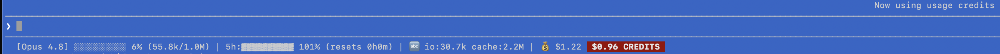

# claude-statusline

A custom status line for [Claude Code](https://claude.com/claude-code) — the single line
rendered directly under the prompt. It shows, at a glance, how much of the context window
you've used, where you stand against your rolling rate limits, cumulative token usage, active
MCP servers, and session cost.

```
[Opus 4.8] ▓▓▓░░░░░░░ 32% (64.0k/200.0k) | 5h:▓▓░░░░░░░░ 21% (resets 3h12m) | 🔤 io:1.2k cache:410.0k | MCP 2:5 | 💰 $1.84 (session $0.42)
```

Claude Code hands the script a JSON blob on stdin every time it re-renders the status line;
the script parses it and prints exactly one line back. That's the whole contract.

---

## Contents

| File | Role |
|---|---|
| `statusline.sh` | **The status line.** This is what you install and run. |
| `statusline_5hr.py` | An earlier companion that computed this session's share of the 5-hour rate-limit window by scanning transcripts on disk. **Not wired up anymore** — kept for reference (see [below](#statusline_5hrpy)). |

---

## Requirements

- **Claude Code**, signed in on a plan that includes it (Pro / Max, or API credits). The status
  line only exists inside Claude Code — there's nothing to run standalone.
- **`jq`** — the script parses JSON with it. `brew install jq` (macOS) or your package manager.
- **bash** and standard Unix tools (`awk`, `sed`, `date`, `stat`) — present by default on
  macOS and Linux.

The 5-hour and 7-day rate-limit segments only appear when you're signed in with a
**subscription** (Pro/Max), because that data comes from the plan's rate-limit window. On
pure pay-as-you-go API billing those segments simply don't render — everything else still does.

---

## Install

### Option A — just ask Claude to do it

Anyone using this already has Claude Code, which means the easiest installer *is* Claude. Open
Claude Code in this repo (or point it at these files) and paste something like:

> Install `claude-statusline/statusline.sh` as my Claude Code status line: copy it to
> `~/.claude/statusline.sh`, make it executable, and add a `statusLine` command entry to
> `~/.claude/settings.json` pointing at it. Then confirm `jq` is installed.

Claude will do the copy, the `chmod`, and the `settings.json` edit for you, and tell you if
`jq` is missing. This is the recommended path — it also fixes the hardcoded path for your
username automatically (see the note under Option B).

### Option B — do it by hand

```bash
# 1. Copy the script into place and make it executable
cp claude-statusline/statusline.sh ~/.claude/statusline.sh
chmod +x ~/.claude/statusline.sh
```

Then point `~/.claude/settings.json` at it. Add (or merge) this block:

```json
{
  "statusLine": {
    "type": "command",
    "command": "/Users/YOUR_USERNAME/.claude/statusline.sh"
  }
}
```

> ⚠️ The `command` must be an **absolute path** — Claude Code does not expand `~`. Replace
> `YOUR_USERNAME` with your actual home directory. On the machine this came from it reads
> `/Users/Admin/.claude/statusline.sh`.

The line refreshes on the next render. If you don't see it, start a new prompt or restart
Claude Code, and check `jq` is installed.

---

## Reading the line

Left to right:

| Segment | Example | Meaning |
|---|---|---|
| **Model** | `[Opus 4.8]` | The active model. |
| **Context bar** | `▓▓▓░░░░░░░ 32% (64.0k/200.0k)` | How full the context window is: a 10-cell bar, the percentage, and used / max tokens. |
| **5-hour window** | `5h:▓▓░░░░░░░░ 21% (resets 3h12m)` | Your rolling 5-hour subscription rate-limit usage and time until it resets. *Subscription only.* |
| **Tokens** | `🔤 io:1.2k cache:410.0k` | Cumulative tokens for the whole session, in two economically meaningful buckets: `io` = fresh input+output, `cache` = cache writes+reads. Summed from the transcript, so it survives multiple API turns. |
| **MCP** | `MCP 2:5` | `servers:calls` — number of MCP servers enabled for this project and MCP tool calls made this session. **Only shown when more than one MCP server is active.** |
| **Cost** | `💰 $1.84 (session $0.42)` | Total cost for this Claude process, and — after a `/clear` — the cost of just the conversation currently on screen. |
| **Credit meter** | `$4.47 CREDITS` at the end | How much of this session's spend came out of paid usage credits rather than plan quota. Absent until a rate-limit window hits 100%. See below. |

### The credit meter



Above: the meter in its counting state, in the wild. Two things to notice.
`💰 $1.22` is the whole session, `$0.96 CREDITS` is only the part billed to
credits — the $0.26 difference is what was spent before the window maxed out.
And Claude Code's own *"Now using usage credits"* banner is on screen at the same
moment the badge is hot, which is a useful confirmation that the proxy this
script latches on (see below) agrees with what Claude Code itself thinks.

The last segment answers a different question from the cost figure next to it:
not *what has this session cost*, but *how much of that was paid credits*. It has
three states:

| State | When | Looks like |
|---|---|---|
| Off | No rate-limit window has maxed out yet | *nothing — the segment is absent* |
| Counting | A window is at 100% | `$4.47 CREDITS` — bold white on a red block, ticking up live |
| Paused | The window has room again | `$6.00 credits` — dim grey, frozen, stays put for the rest of the session |

When a window hits 100% the script anchors `total_cost_usd` and counts only the
delta from there, which is why the line can read `💰 $11.00 (session $6.00)` next
to `$6.00 credits` — the meter started when the limit tripped, not when the
session did, and stopped adding the moment the window reset. Dropping back into
overage resumes counting *on top of* the accumulated figure, so a session that
bounces in and out of the limit still shows one cumulative number.

State lives in `~/.claude/.statusline-credit/<session_id>` as
`accum anchor active`, written only on transitions and pruned after 7 days.

### Three design details worth knowing before you edit it

- **Cost is per-session, not per-process.** Claude Code's `total_cost_usd` keeps climbing
  across a `/clear`, but `/clear` starts a *new* session. The script records the running total
  the first time it sees a session ID (baselines are stored under
  `~/.claude/.statusline-cost/`, auto-pruned after 7 days) and subtracts that baseline, so the
  `(session $…)` figure reflects only the conversation actually on screen. Resumed sessions
  (`--continue`/`--resume`) restart the counter, and the script falls back to 0 rather than
  going negative.

- **The MCP server list is cached for 60s.** `claude mcp list` does live health checks and
  takes ~2 seconds — far too slow to run on every render — so the connected-server list is
  refreshed in the background into `~/.claude/.statusline-mcp-cache`, while per-project
  enable/disable overrides from `~/.claude.json` are read fresh each render (those are cheap).

- **"On credits" is inferred, not reported.** The payload carries no overage or credit flag —
  checked directly, and it's absent even with credits enabled. A rate-limit window at 100% is
  the only observable proxy, so that's what the meter latches on; if Claude Code ever exposes
  a real flag, that's the one condition to swap out. The screenshot above is the best evidence
  the proxy is sound: Claude Code's own "Now using usage credits" banner is up while the badge
  counts. Note the window reads **101%** there — usage can overshoot, so the check is `>= 100`,
  not `== 100`. Resumed sessions restart the
  process cost counter at 0, which would strand the credit anchor above it — the script
  re-anchors instead of reporting a negative.

---

## `statusline_5hr.py`

An earlier approach to the 5-hour segment. Instead of reading rate-limit data from the payload,
it globs `~/.claude/projects/*/*.jsonl`, sums token usage per session inside the current 5-hour
window, and prints this session's **share** of that total as a single integer percentage.

It's **not wired into `statusline.sh` anymore** — the main script now gets rate-limit data
directly from the JSON payload, which is simpler and doesn't touch the disk. The Python script
is kept because the transcript-scanning technique is genuinely useful and may be worth reviving
(e.g. for cross-session analytics the payload doesn't expose). It's purely local and never calls
the Claude API. If you want to use it, it reads the same stdin JSON and prints one number:

```bash
echo "$STATUSLINE_JSON" | python3 statusline_5hr.py   # -> e.g. 37
```

---

## Customize

Everything is plain bash — edit `~/.claude/statusline.sh` directly:

- **Bar width** — change `BAR_WIDTH=10`.
- **Bar characters** — the `▓` (filled) and `░` (empty) glyphs in `make_bar`.
- **Which segments show** — the final block assembles `OUT` from the segment strings; comment
  out any `OUT="$OUT | …"` line to drop that segment.
- **MCP visibility threshold** — it's hidden unless `MCP_SRV_COUNT > 1`; change that test to
  always show it.

Debug it in isolation by feeding it a saved payload:

```bash
echo '{"model":{"display_name":"Opus 4.8"},"context_window":{"used_percentage":32,"total_input_tokens":64000,"context_window_size":200000},"cost":{"total_cost_usd":1.84}}' \
  | ~/.claude/statusline.sh
```

---

## Uninstall

Remove the `statusLine` block from `~/.claude/settings.json` (or set it back to whatever you
had before), and optionally delete `~/.claude/statusline.sh`. The cache/baseline files under
`~/.claude/.statusline-*` are harmless but can be removed too.
